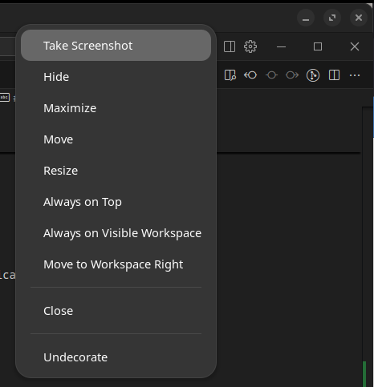

# Navigation and Hotkeys

Manjikaze is configured to enable efficient keyboard-based navigation and window management. This guide will help you learn the key shortcuts that will make you more productive.

## Workspaces

Manjikaze is configured with 3 fixed workspaces by default. These workspaces allow you to organize your applications and tasks effectively across multiple virtual desktops.

### Workspace Usage Strategies

You can use workspaces in various ways depending on your workflow:

- **Project-based**: Dedicate each workspace to a different project
- **Task-based**: Organize by activity type (coding, documentation, communication)
- **Context-based**: Separate work and reference materials (code editor in one workspace, documentation browser in another)

### Workspace Navigation

| Shortcut | Action |
|----------|--------|
| `Super + 1` | Switch to workspace 1 |
| `Super + 2` | Switch to workspace 2 |
| `Super + 3` | Switch to workspace 3 |

## Application Shortcuts

Manjikaze provides quick shortcuts to launch and manage common applications:

| Shortcut | Action |
|----------|--------|
| `Super + W` | Launch web browser |
| `Super + E` | Open file explorer (Nautilus) |
| `Super + Space` | Open application launcher |

## Window Management

Efficiently manage your windows with these shortcuts:

| Shortcut | Action |
|----------|--------|
| `Super + Up` | Maximize window |
| `Super + BackSpace` | Begin window resize |
| `Alt + F4` | Close window |
| `Alt + Tab` | Switch between windows |

### Undecorate Extension

Manjikaze includes the Undecorate extension which allows you to remove window decorations:

- **What it fixes**: Applications like Cursor render with a double toolbar, creating wasted space
- **How to use**: Right-click the top toolbar of a window and select "Undecorate" from the menu
- **Moving undecorated windows**: Press `Super + BackSpace` to begin resize/move mode
- **Better alternative**: Use the Tactile tiling shortcuts (see [Tiling documentation](tiling.md)) for more efficient window management

## Multi-Monitor Setup

Manjikaze is optimized for multi-monitor configurations:

- The dock appears at the bottom of each monitor
- Workspaces are isolated per monitor, allowing different workspaces on each screen
- The dash (app launcher) is configured to appear on each monitor independently

## Screenshots

| Shortcut | Action |
|----------|--------|
| `Super + Print` | Take a screenshot (using Flameshot) |

## File Management

Nautilus (the file manager) is configured with the following settings:

- List view by default
- Smaller icon size for more compact viewing
- Folders sorted before files
- Webdev folder bookmark automatically added

To navigate quickly to your development directory:

1. Press `Super + E` to open Nautilus
2. Click on the "Webdev" bookmark in the sidebar

---

[← Features](README.md) | [Tiling →](tiling.md)
