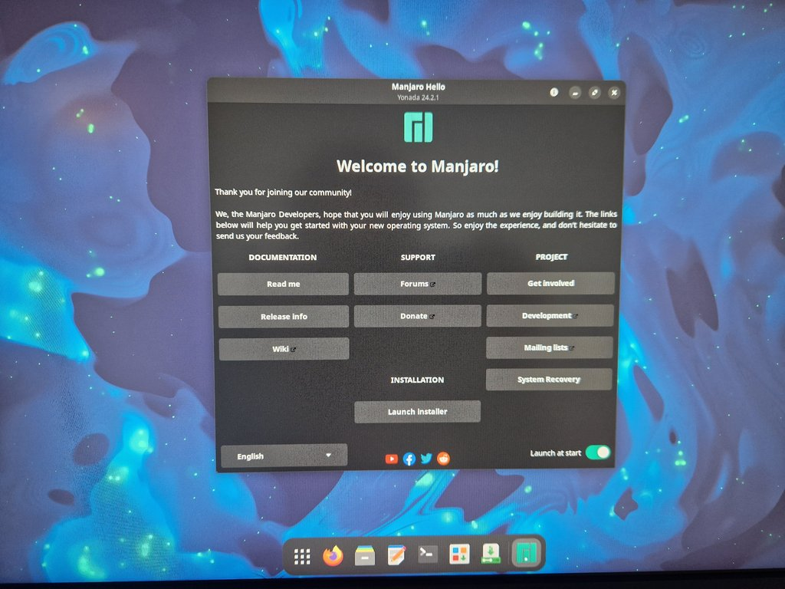
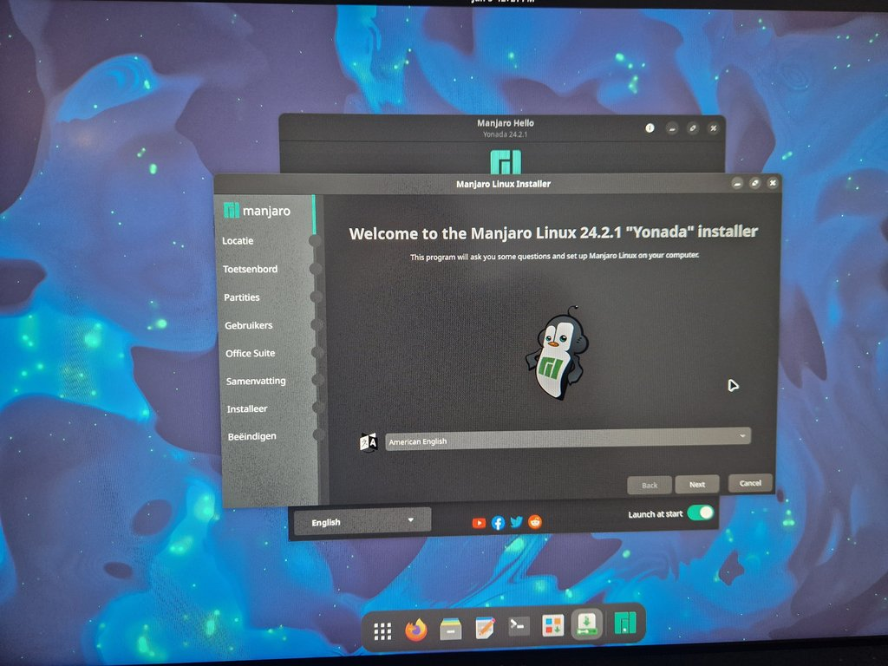
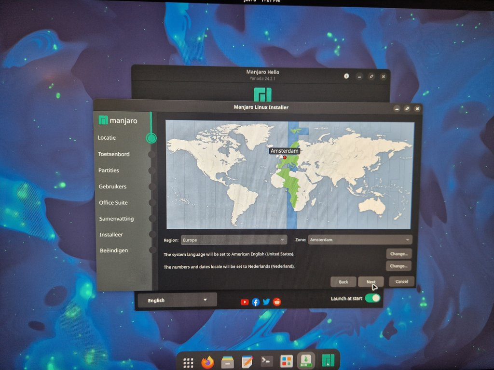
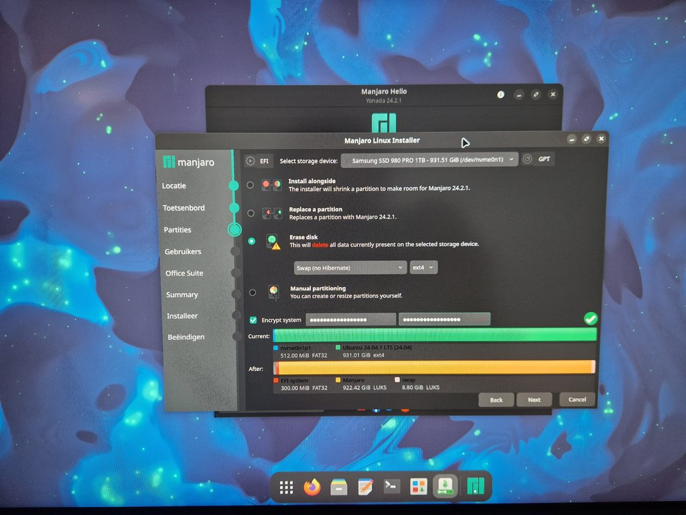
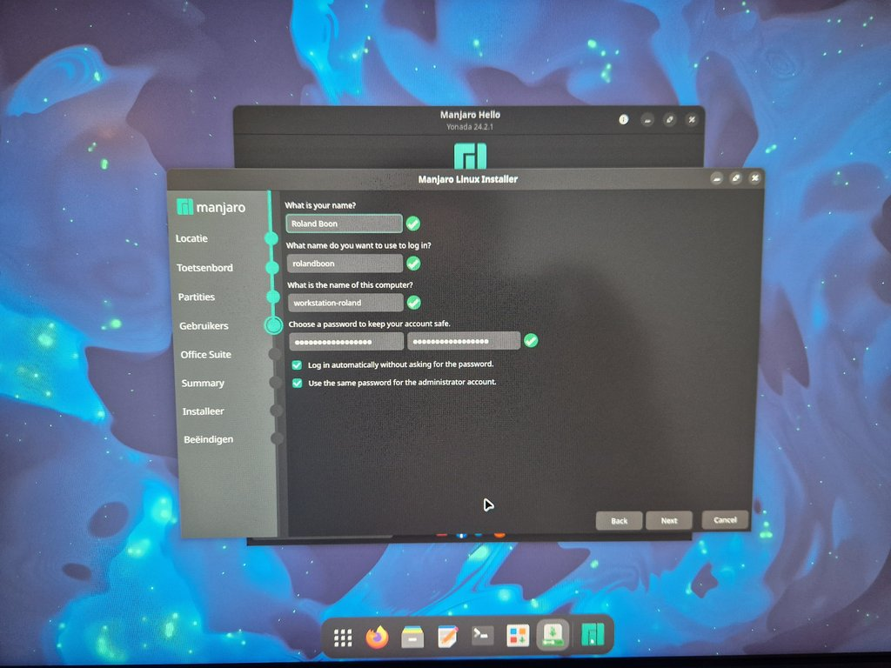
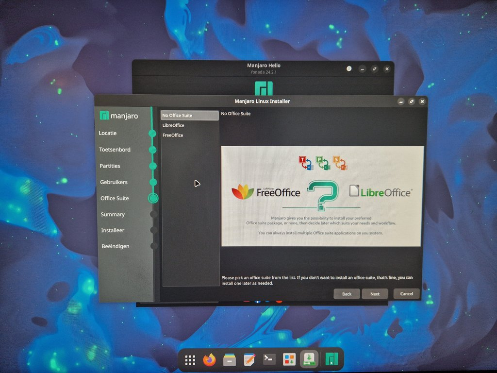
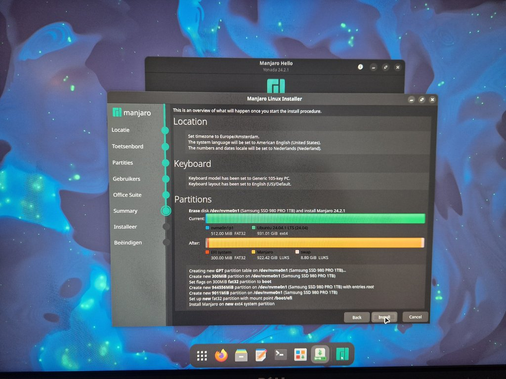
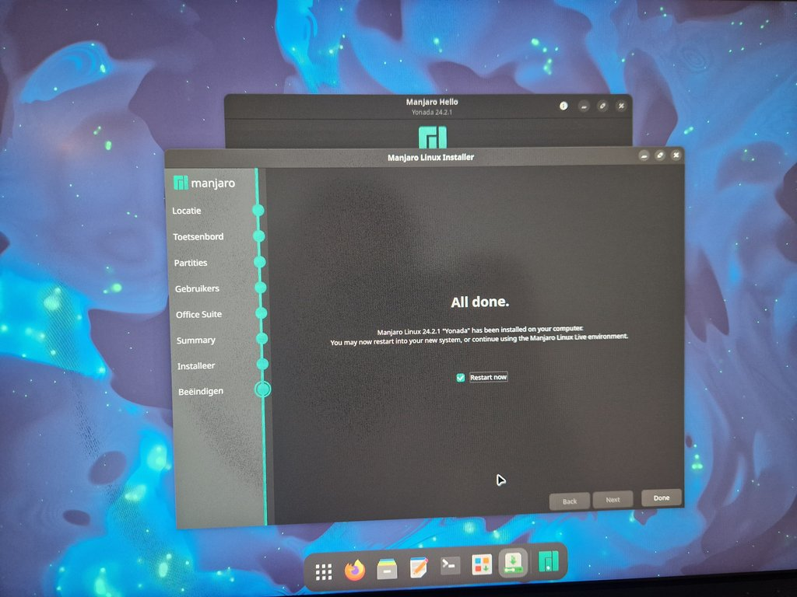
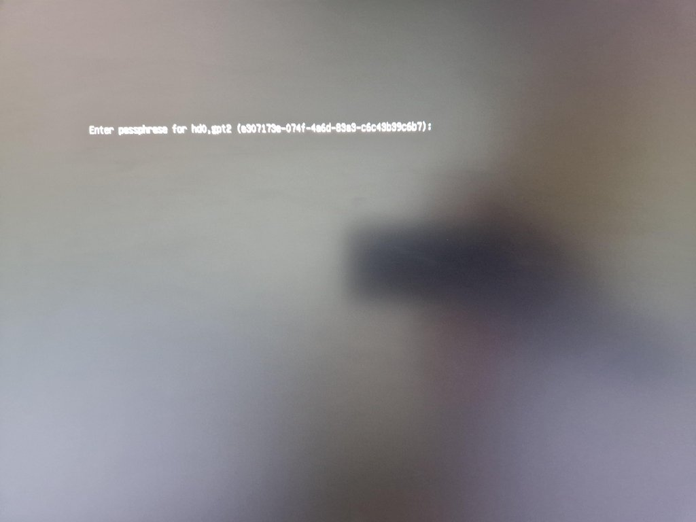

# Installation

This guide walks you through the process of installing both Manjaro Linux and the Manjikaze development environment.

## Manjaro Installation

Before proceeding, ensure you have completed all the [preparations](preparations.md).

1. **Boot from USB**
   - Insert your Manjaro GNOME USB stick
   - Boot your computer from the USB (you may need to change boot order in BIOS/UEFI)
   - Wait for the Manjaro live environment to load

2. **Launch Installer**
   - Click the "Launch Installer" button on the Manjaro Hello welcome screen
   

3. **Language Selection**
   - Select your preferred language (English is recommended as all guides and documentation are in English)
   

4. **Region Selection**
   - Select your region/timezone
   - This determines your timezone, number and currency formatting
   

5. **Disk Partitioning**
   - Select your SSD
   - Choose "Erase disk" option
   - Select ext4 file system
   - **Important**: Check the "Encrypt system" checkbox
   - Enter your secure password (the one you prepared that meets our security requirements)
   

6. **User Configuration**
   - Enter your full name and desired username
   - Choose a computer name (hostname)
   - Enter your secure password again
   - Check "Log in automatically" to avoid entering your password twice when booting
   - Choose whether to use the same password for the admin account (recommended)
   

7. **Office Suite Selection**
   - Choose "No Office Suite" option
   - Manjikaze will manage the installation of all necessary applications
   

8. **Installation Summary**
   - Review the installation summary
   - Click "Install" to begin the installation process
   

9. **Finishing Installation**
   - Once installation is complete, click "Done"
   - Remove the USB stick
   - Restart your computer
   

10. **First Boot: Disk Decryption**
    - Upon booting, you'll be prompted for your password to decrypt the hard drive. This is the secure password you set during the "Disk Partitioning" step.
    - Enter your secure password
    - Note: This decryption process takes approximately 1 minute on modern SSDs
    

11. **First Login**
    - The system will finish booting and log you in automatically if you selected the "Log in automatically" option during user configuration. Otherwise, you will be prompted to log in with your username and password.

## Manjikaze Installation

Once Manjaro is installed and running, you can proceed with installing the Manjikaze environment:

1. **Launch Terminal**
   - Open a terminal (you can use the keyboard shortcut `Ctrl+Alt+T`)

2. **Run Installation Script**
   - Ensure you are connected to the internet.
   - Execute the following command:

   ```bash
   curl -s https://raw.githubusercontent.com/10kb/manjikaze/main/install.sh | bash
   ```

   - This will download and run the Manjikaze installation script

3. **Using Manjikaze**
   - After installation completes, start Manjikaze by typing the following command in the terminal:

   ```bash
   manjikaze
   ```

   - You'll be presented with the Manjikaze menu interface
   - From here, you can configure various aspects of your development environment

## Next Steps

After installation, we recommend:

1. Installing the essential development tools for your work
2. Configuring operating system preferences
3. Following the security configuration steps to set up Yubikey authentication

See the [Using Manjikaze](using-manjikaze.md) section for details about these steps.
